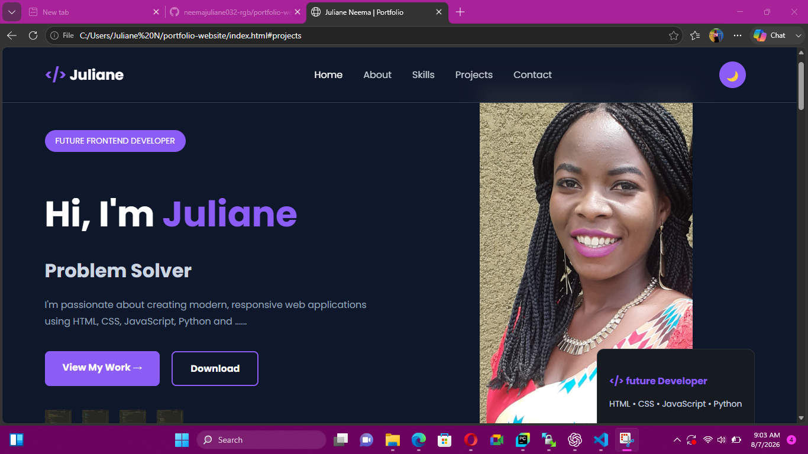

# 🌐 Juliane Neema - Portfolio Website

A modern, responsive personal portfolio website built with **HTML, CSS, and JavaScript**. This project showcases my skills, projects, and journey as a web developer.

## 🚀 Live Demo

Coming Soon

## 📸 Preview



## ✨ Features

- Responsive design for desktop and mobile
- Dark and Light mode toggle
- Animated Hero section
- Scroll reveal animations
- Skills progress bars
- Project showcase
- Contact form with JavaScript validation
- Back-to-top button
- Smooth scrolling navigation

## 🛠️ Technologies Used

- HTML5
- CSS3
- JavaScript (Vanilla JavaScript)
- Git
- GitHub

## 📂 Project Structure

```
portfolio-website/
│── index.html
│── css/
│   └── style.css
│── js/
│   └── script.js
│── image/
│── README.md
```

## 📚 JavaScript Concepts Used

This project demonstrates several JavaScript concepts, including:

- DOM Manipulation
- Event Listeners
- Form Validation
- Dark/Light Theme Toggle
- Local Storage
- Scroll Reveal Animation
- Typing Animation
- Back-to-Top Button

## 🎯 Future Improvements

- Connect the contact form to a backend
- Add more projects
- Improve accessibility
- Add project filtering
- Optimize performance

## 👩‍💻 Author

**Juliane Neema**

GitHub: https://github.com/neemajuliane032-rgb

Email: neemajuliane032@gmail.com

## 📄 License

This project is licensed under the MIT License.
=======
# portfolio-website
This is my template portfolio website (html)

